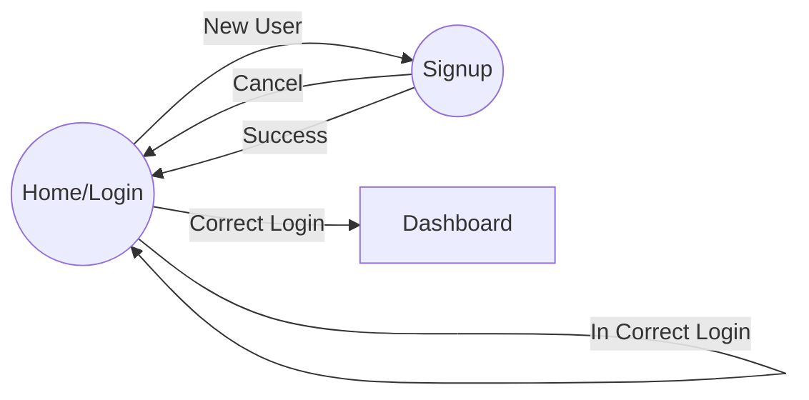

# angular-bootstrap-example
A example app to demonstrate page flows using Angular v5 &amp; Bootstrap v4 frameworks

## Usage

 1. Checkout Code
 2. Use npm install, build & serve.
 3. Open http://localhost:4200/home

Use admin/admin as username/password, the dummy logic is hardcoded to let call through.
Use browsers developer tool to monitor flow and logger statements.

## Screenshots

|Home Screen|Signup|Dashboard|
|--|--|--|
||||

## Flow
diagram:

